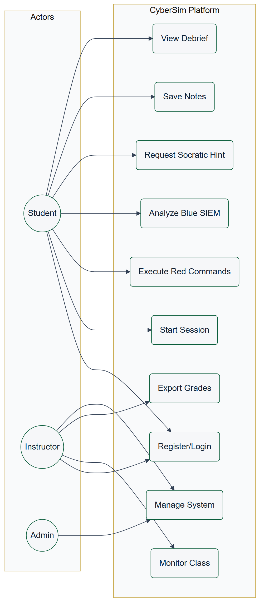

# CHAPTER 3: SYSTEM REQUIREMENTS ENGINEERING AND ANALYSIS

## 3.1 Feasibility Study

Parallax is feasible as a university graduation project because its runtime architecture uses widely available open-source technologies and a single-node Docker deployment model. The platform avoids expensive cloud-only dependencies by running the frontend, backend, database, cache, SIEM services, and scenario containers on one Docker host.

Technical feasibility is supported by:

- React and Vite for the browser interface.
- FastAPI for backend APIs and WebSocket routing.
- PostgreSQL for durable session and report data.
- Redis for realtime and cache support.
- Elasticsearch and Filebeat for SIEM-style telemetry.
- Docker Compose for repeatable local deployment.
- Isolated Docker scenario networks for safe training.

Operational feasibility is supported by:

- Local setup documentation.
- Demo-day scripts.
- Readiness checks.
- Scenario profiles that can be started independently.

## 3.2 Requirement Gathering Methods

The requirements were derived from:

- The KASIT product-based graduation project handbook.
- Cybersecurity training needs for students and instructors.
- Existing cyber range, CTF, and SOC training platform gaps.
- The project's master blueprint and continuous state tracker.
- Implementation evidence from the existing repository.
- Verification outputs from tests, builds, and demo checks.

## 3.3 Target Users

| User | Description | Main Goals |
| --- | --- | --- |
| Student Red Team operator | Learner practicing offensive methodology inside sandboxed targets | Explore, document, complete milestones, understand attack path |
| Student Blue Team analyst | Learner investigating telemetry and response evidence | Triage events, correlate activity, write incident notes |
| Instructor | Course supervisor or lab evaluator | Monitor sessions, evaluate progress, export grades |
| Administrator | Person deploying or maintaining the platform | Configure, verify, troubleshoot, recover |
| Examiner | Graduation project reviewer | Understand scope, architecture, implementation, testing, and contribution |

## 3.4 Functional Requirements

| ID | Requirement |
| --- | --- |
| FR-AUTH-01 | The platform shall support student registration and login. |
| FR-AUTH-02 | The platform shall support role-based instructor access. |
| FR-SCEN-01 | The platform shall list active scenarios SC-01, SC-02, and SC-03. |
| FR-SESS-01 | The platform shall start, track, and end scenario sessions. |
| FR-ROE-01 | The platform shall require rules-of-engagement acknowledgement. |
| FR-TERM-01 | The platform shall provide a browser terminal connected to a sandbox session. |
| FR-SIEM-01 | The platform shall display scenario telemetry in a Blue Team SIEM workspace. |
| FR-NOTE-01 | The platform shall allow tagged notes and evidence collection. |
| FR-HINT-01 | The platform shall provide bounded hints through structured hint trees and AI assistance. |
| FR-GATE-01 | The platform shall enforce methodology gates and scenario phases. |
| FR-SCORE-01 | The platform shall calculate scoring and progress. |
| FR-REPORT-01 | The platform shall generate debrief and report data. |
| FR-INST-01 | The platform shall provide instructor analytics and grade export. |
| FR-READY-01 | The platform shall provide readiness checks for demo and session startup. |
| FR-FORENSICS-01 | The platform shall provide simulated Blue Team forensics and containment workflows. |

The functional scope above is summarized as a use case model in Figure 3.1. The model groups the platform behavior around four primary actors (Red Team student, Blue Team student, instructor, and administrator) and the bounded AI provider, and it shows how the same session is shared between the offensive and defensive use cases.

Figure 3.1: Parallax use case model.

## 3.5 Non-Functional Requirements

| ID | Requirement | Rationale |
| --- | --- | --- |
| NFR-SEC-01 | Scenario networks must be isolated from the internet. | Prevent accidental real-world targeting or unsafe network behavior |
| NFR-SEC-02 | Secrets must be loaded through environment variables. | Avoid credential leakage in source control |
| NFR-SEC-03 | AI context must be bounded and redacted. | Prevent unsafe disclosure and keep hints educational |
| NFR-PERF-01 | The system should run on a single local Docker host. | Support university demos and local labs |
| NFR-REL-01 | The system must provide health and readiness checks. | Support reliable defense demos |
| NFR-UX-01 | Red Team and Blue Team workflows must be visually distinct. | Help students understand both perspectives |
| NFR-MAINT-01 | Documentation must trace requirements to implementation and tests. | Support maintainability and examiner review |

## 3.6 Security and Safety Requirements

Parallax is an educational platform. Its safety requirements are mandatory:

- All scenario activity must remain inside Docker-isolated networks.
- The platform must not be used against real external systems.
- Scenario content must avoid real malware and unsafe payload distribution.
- AI guidance must stay Socratic and bounded.
- Full terminal output should not be stored permanently by default.
- Secrets must not be committed or displayed in final documentation.
- Instructor-only routes must enforce role checks.

## 3.7 Usability and UX Goals

| Goal | Description |
| --- | --- |
| Clear role separation | Red and Blue workspaces should make offensive and defensive responsibilities obvious |
| Low friction scenario start | Students should understand readiness, ROE, role, and objective before acting |
| Evidence-first workflow | Notes, SIEM triage, and debriefs should encourage documentation habits |
| Instructor visibility | Instructors should quickly identify active sessions, weak phases, hints used, and grading evidence |
| Demo reliability | Recovery and readiness UX should reduce presentation risk |

## 3.8 Educational Requirements

Parallax should teach:

- Structured methodology such as PTES and incident response reasoning.
- OWASP-style web application testing through SC-01.
- Active Directory attack/detection concepts through SC-02.
- Phishing and initial access analysis through SC-03.
- Red-to-Blue causality: how actions create telemetry.
- Evidence documentation and reporting.
- Safe and ethical boundaries for cybersecurity practice.

## 3.9 Scenario Requirements

Each scenario must define:

- Story and organization context.
- Red Team learning objectives.
- Blue Team learning objectives.
- Network topology.
- Containers and services.
- Methodology phases.
- Hints and guidance levels.
- SIEM/detection logic.
- Scoring and completion rules.
- Evidence expectations.
- Reset/readiness behavior.

## 3.10 Data Requirements

Parallax must persist:

- Users and roles.
- Sessions and lifecycle state.
- Notes.
- Command metadata.
- SIEM events.
- Triage decisions.
- AI interaction metadata.
- User activity.
- Simulated containment actions.
- Report/debrief source data.

Parallax must avoid persisting:

- Real secrets.
- Unbounded raw terminal output.
- Data from real external systems.

## 3.11 Requirements Traceability

The detailed traceability matrix is maintained in `docs/final-report/requirements-traceability-matrix.md`. The final report should include a summarized matrix and place the complete matrix in an appendix.

