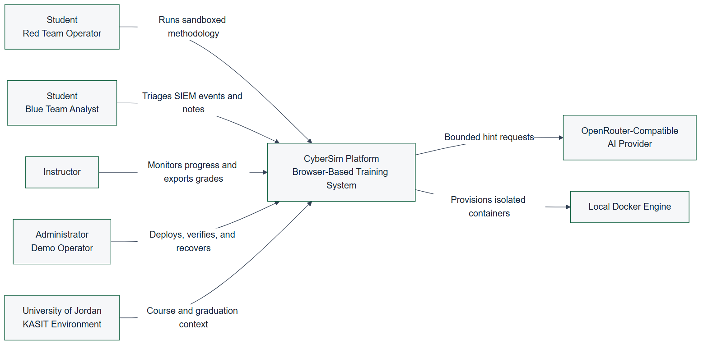
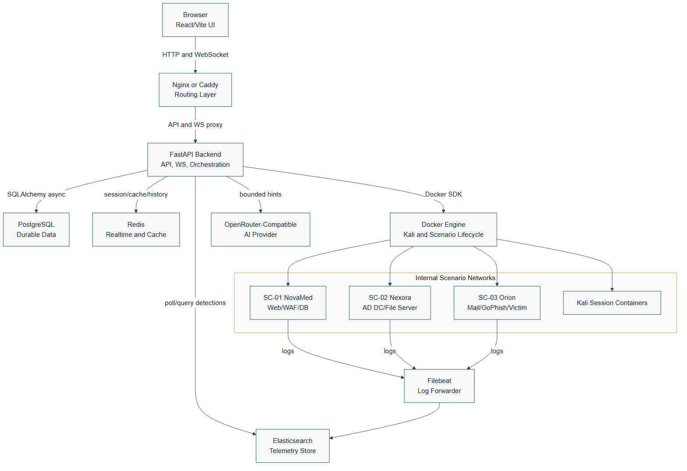
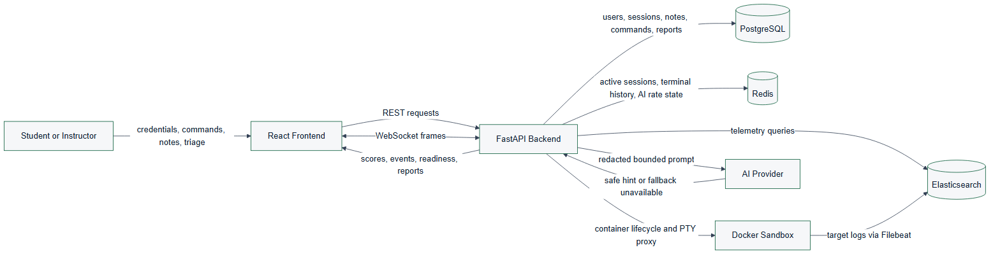
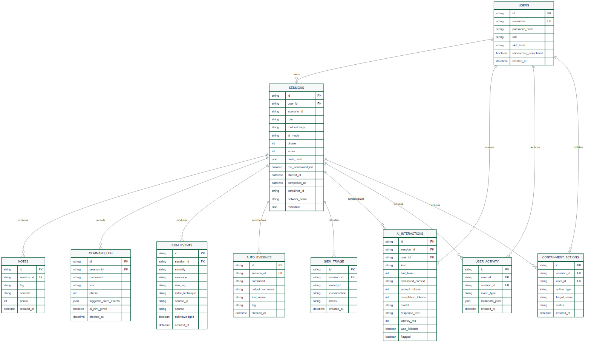
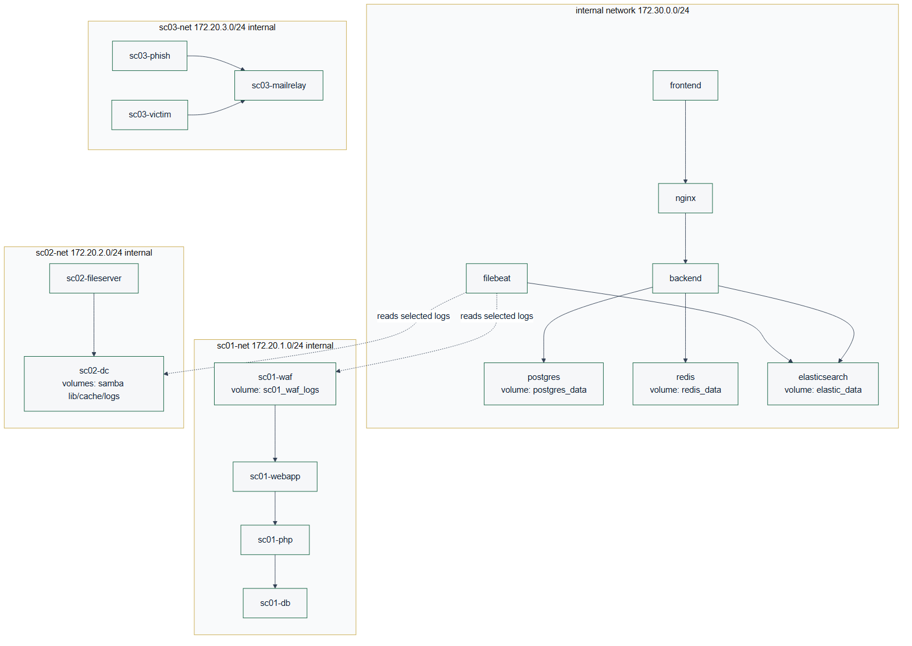
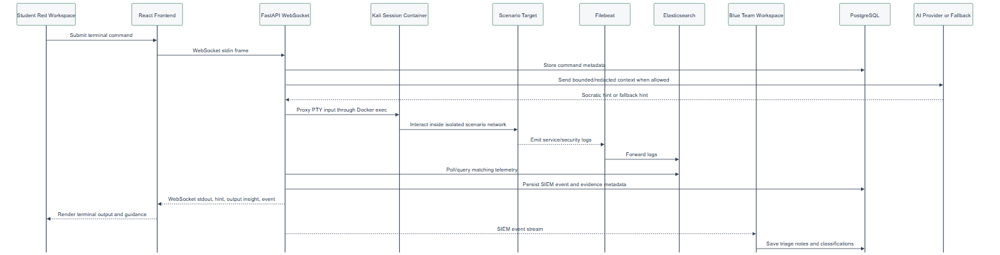

# Chapter 04 - System Design

This chapter explains the design of CyberSim as implemented in the current project workspace. It is written as the source text for the formal graduation report and should be converted into the KASIT handbook style during DOCX production.

## 4.1 Design Objective

CyberSim is designed as a browser-based cybersecurity training platform that joins offensive practice and defensive analysis in one controlled environment. The design goal is not to create an open penetration testing tool. The design goal is to create a safe university lab where a student can perform scoped Red Team actions against isolated Docker targets and immediately observe the Blue Team evidence generated by those actions.

The platform therefore has four design priorities:

1. Safety: all scenario activity must stay inside local Docker scenario networks.
2. Causality: the system must connect Red Team actions to Blue Team evidence.
3. Learning: hints, methodology gates, notes, scoring, and debriefs must support learning rather than simply giving answers.
4. Evidence: student work must be stored in a way that supports reports, instructor review, and grading.

The design was verified against local project sources using a Repomix source inventory of 210 files covering backend, frontend, scenarios, Docker infrastructure, AI prompts, and report-relevant documentation.

## 4.2 Design Constraints

The system design follows the following constraints:

| Constraint | Design response |
| --- | --- |
| University demo environment | Use a single-node Docker Compose deployment that can run on a local machine. |
| Cybersecurity safety | Use Docker `internal: true` networks for scenario targets and document strict scope boundaries. |
| Large application scope | Separate runtime responsibilities into frontend, backend, data stores, telemetry, scenario targets, and documentation. |
| Real-time learning loop | Use WebSockets for terminal output, readiness updates, hints, SIEM events, and output insights. |
| Durable reporting | Store users, sessions, notes, command metadata, SIEM events, AI interactions, activity, triage, and containment records in PostgreSQL. |
| Responsive runtime state | Use Redis for active sessions, terminal history, cooldown state, and realtime support. |
| Realistic defensive telemetry | Use Elasticsearch and Filebeat for the SIEM path rather than relying only on mock frontend events. |
| AI safety | Send bounded and redacted context only after command submission, never on every keystroke. |
| Active MVP scope | Limit the report and deliverables to SC-01, SC-02, and SC-03. |

## 4.3 System Context Design

CyberSim sits between students, instructors, the local Docker runtime, and a bounded AI provider. The main external actors are:

- Red Team student: uses the terminal and methodology interface to perform scoped tasks.
- Blue Team student: watches SIEM events, triages alerts, records notes, and performs simulated response actions.
- Instructor: monitors class progress, reviews reports, and exports grades.
- Administrator or demo operator: starts services, checks readiness, and recovers the environment.
- AI provider: receives bounded hint requests and returns short Socratic guidance or is bypassed by fallback hints.
- University environment: provides course, grading, and graduation-project context.

Figure 4.1: CyberSim system context.

This context view is important because it separates the training platform from real-world targets. Docker is an infrastructure dependency that provisions local lab containers. It is not treated as an external victim network, and the system should never instruct students to test real hosts.

## 4.4 Container Architecture Design

The runtime architecture is organized around a React frontend, a FastAPI backend, three data services, telemetry forwarding, and scenario target networks. The browser communicates with the backend through an Nginx or Caddy routing layer. The backend owns API behavior, WebSocket routing, Docker orchestration, scenario logic, scoring, reports, AI calls, and instructor analytics.

Figure 4.2: CyberSim container architecture.

The major containers and services are:

| Component | Responsibility |
| --- | --- |
| React/Vite frontend | Provides landing, authentication, dashboard, Red Workspace, Blue Workspace, Debrief, profile, settings, onboarding, and instructor pages. |
| FastAPI backend | Provides REST APIs, WebSocket endpoints, session orchestration, scenario logic, AI monitor, scoring, reports, SIEM routes, and instructor routes. |
| PostgreSQL | Stores durable application data for reporting and instructor review. |
| Redis | Stores volatile realtime state, terminal history, session cache, and AI cooldown/budget data. |
| Elasticsearch | Stores searchable telemetry and SIEM-related records. |
| Filebeat | Forwards selected scenario logs into Elasticsearch. |
| Docker Engine | Runs Kali session containers and scenario target containers. |
| Scenario services | Provide the isolated lab targets for SC-01, SC-02, and SC-03. |

The design uses a single-node Compose topology because it matches the university demonstration context. This is more practical than Kubernetes for local defense demos and classroom deployment. It also reduces installation complexity for examiners.

## 4.5 Data Flow Design

CyberSim has two central flows: request-response API data and event-driven learning telemetry. REST endpoints handle structured operations such as login, scenario listing, session start, note creation, report retrieval, scoring, instructor views, and containment records. WebSockets handle terminal and live session behavior where low latency matters.

Figure 4.3: CyberSim DFD Level 0.

The top-level data flow is:

1. A user authenticates and selects a scenario in the React frontend.
2. The frontend starts or resumes a session through the FastAPI backend.
3. The backend creates durable session state in PostgreSQL and volatile state in Redis.
4. The Red Team workspace sends terminal input through a WebSocket.
5. The backend records command metadata and proxies the terminal stream to the Kali container.
6. The Kali container interacts only with target services on the scenario network.
7. Scenario services produce logs and telemetry.
8. Filebeat forwards selected logs to Elasticsearch.
9. The backend queries or matches telemetry and emits SIEM events to the Blue Team workspace.
10. Notes, triage, AI interactions, scores, and evidence are stored for debrief and instructor review.

This flow creates the learning link: student action, telemetry, analysis, evidence, and feedback.

## 4.6 Database Design

The relational model is centered on users and sessions. A session represents one student's work in one scenario and one role. It connects to notes, commands, SIEM events, triage decisions, AI interactions, activity records, containment actions, and auto evidence.

Figure 4.4: CyberSim core ERD.

The core table responsibilities are:

| Table | Design purpose |
| --- | --- |
| `users` | Stores identity, role, skill level, and onboarding state. |
| `sessions` | Stores the scenario, role, methodology, AI mode, phase, score, sandbox IDs, and lifecycle. |
| `notes` | Stores findings, evidence notes, and methodology notes. |
| `command_log` | Stores command metadata, tool name, phase, SIEM triggers, and AI hint flag. |
| `siem_events` | Stores events shown to Blue Team and used in reports and timelines. |
| `siem_triage` | Stores analyst classification and notes for events. |
| `ai_interactions` | Stores AI usage metadata, hint level, model, latency, fallback state, and safety flags. |
| `user_activity` | Stores audit-style activity entries for student and instructor workflows. |
| `containment_actions` | Stores simulated Blue Team response actions. |
| `auto_evidence` | Stores concise evidence summaries detected from command output patterns. |

The report should state that CyberSim stores command metadata and selected evidence, not full terminal output as the main durable record. This keeps the database focused on learning evidence and avoids storing unnecessary raw output.

## 4.7 Backend Module Design

The backend is a modular FastAPI application. The source inventory identifies these main backend domains:

| Domain | Representative files | Responsibility |
| --- | --- | --- |
| Application setup | `backend/src/main.py` | Creates the FastAPI app, configures middleware, includes routers, and runs startup tasks. |
| Authentication | `backend/src/auth/routes.py` | Registers users, logs in users, returns current profile, and updates profile state. |
| Sessions | `backend/src/sessions/routes.py` | Starts sessions, returns active sessions, handles ROE acknowledgement, readiness, flags, and session lifecycle. |
| WebSocket | `backend/src/ws/routes.py` | Handles terminal frames, reconnect history, readiness messages, hints, phase updates, and live events. |
| Sandbox | `backend/src/sandbox/manager.py`, `backend/src/sandbox/terminal.py`, `backend/src/sandbox/readiness.py` | Starts scenario targets, provisions Kali containers, streams terminal output, checks readiness, and cleans stale resources. |
| Scenarios | `backend/src/scenarios/` | Loads YAML, evaluates gates, advances phases, detects output patterns, handles hints, and tracks branches. |
| SIEM | `backend/src/siem/` | Maps commands to detection events, polls telemetry, provides forensics and response routes. |
| AI | `backend/src/ai/` and `ai-monitor/system_prompt.md` | Builds bounded context, validates output, tracks discoveries, provides fallback hints, and supports debrief coaching. |
| Reports | `backend/src/reports/` | Generates report summaries, debrief data, learning insights, and bounded debrief Q&A. |
| Instructor | `backend/src/instructor/` | Provides session monitoring, metrics, user management, analytics, exports, and live inspection. |

The module split keeps the application understandable. Scenario behavior is not hardcoded into frontend components; it is loaded from YAML and backend scenario modules. Frontend components render the state and send user actions to the backend.

## 4.8 Frontend Workspace Design

The frontend is organized around pages and reusable components:

| Area | Main files | Design role |
| --- | --- | --- |
| Navigation and route shell | `frontend/src/App.jsx`, `frontend/src/components/nav/CyberSimNav.jsx` | Controls authenticated navigation and page composition. |
| Dashboard | `frontend/src/pages/Dashboard.jsx`, `frontend/src/components/dashboard/ScenarioCard.jsx` | Presents active scenarios and session entry points. |
| Red Workspace | `frontend/src/pages/RedWorkspace.jsx`, `frontend/src/components/terminal/`, `frontend/src/components/methodology/`, `frontend/src/components/notes/`, `frontend/src/components/hints/` | Combines terminal, methodology progress, notes, hints, output insights, and readiness. |
| Blue Workspace | `frontend/src/pages/BlueWorkspace.jsx`, `frontend/src/components/siem/` | Shows SIEM feed, forensics, triage, containment, and analyst workflow. |
| Debrief | `frontend/src/pages/Debrief.jsx`, `frontend/src/components/killchain/` | Turns session data into a post-mission learning summary. |
| Instructor | `frontend/src/pages/InstructorDashboard.jsx` | Shows class metrics, session monitoring, user management, AI usage, and grade exports. |
| State and hooks | `frontend/src/store/`, `frontend/src/hooks/` | Handles auth, session state, layouts, settings, terminal integration, and WebSocket behavior. |

The UI design follows a dual-workspace model. Red Team and Blue Team views are related but not identical. The Red Team view optimizes for terminal work, methodology guidance, notes, and hints. The Blue Team view optimizes for alert scanning, event triage, forensics, and containment.

## 4.9 Scenario Design

The active scenario design contains exactly three high-fidelity scenarios:

| Scenario | Training focus | Main target services |
| --- | --- | --- |
| SC-01 NovaMed Healthcare | Web application security and OWASP-oriented analysis | Web/WAF/database service chain |
| SC-02 Nexora Financial | Active Directory style compromise and detection | Domain controller and file server |
| SC-03 Orion Logistics | Phishing and initial-access simulation | GoPhish, mail relay, victim simulator |

Each scenario has a specification file, backend hints, output patterns, event maps, and Docker target files. The scenario engine uses this structured content to support phase progression, hint selection, scoring, and SIEM event generation.

The report should avoid printing scenario solution commands, flags, or lab-only credentials. It should instead document:

- Learning objectives.
- Target topology.
- Defensive telemetry.
- Safety boundary.
- Methodology phases.
- Evidence artifacts.
- Scoring and hints.
- Blue Team tasks.

## 4.10 Docker Topology and Isolation Design

The Docker design uses one internal application network and separate internal scenario networks. The active scenario networks are:

- `sc01-net` for SC-01.
- `sc02-net` for SC-02.
- `sc03-net` for SC-03.

Figure 4.5: Docker network and service topology.

The scenario networks are configured as internal networks. This means the scenario services are intended for local lab interaction through the platform and not for internet access. The backend starts scenario-specific targets through Docker Compose profiles and provisions Kali session containers onto the correct scenario network.

The topology supports repeatable university demonstrations because it keeps the infrastructure local:

- Core services are started once.
- Scenario targets are started by profile.
- Kali session containers are provisioned per session.
- Logs flow from scenario services to Filebeat and Elasticsearch.
- PostgreSQL and Redis maintain platform state.

## 4.11 Red-to-Blue Event Sequence

The most important behavior in CyberSim is the Red-to-Blue event loop. The loop begins when the student submits a terminal command. The frontend sends the command to the backend over WebSocket. The backend records metadata, checks scenario behavior, optionally asks the AI monitor for bounded guidance, and forwards the command to the Kali container. Target services emit logs, Filebeat forwards them, and the backend converts matched telemetry into Blue Team events and report evidence.

Figure 4.6: Red-to-Blue event sequence.

This sequence is why CyberSim is a dual-perspective platform instead of a standard vulnerable-machine lab. Students do not only perform actions. They also see how those actions appear to defenders.

## 4.12 AI Guidance Design

The AI monitor is designed as a safety-bounded learning assistant. It should help a student think, not solve the scenario for them. The design rules are:

- AI calls happen on command submission, not every keystroke.
- Context is bounded to the scenario, phase, role, and selected command/evidence metadata.
- Known scenario secrets and unsafe direct-answer patterns are filtered.
- Responses should be short Socratic hints.
- Fallback hints are available when the provider is missing, unavailable, or rate-limited.
- Instructor and report flows can inspect AI usage metadata.

This design supports learning while reducing the chance that the AI becomes a solution generator. The AI path should be documented alongside rate limits, redaction, fallback behavior, and instructor visibility.

## 4.13 Security and Safety Design

CyberSim handles cybersecurity training content, so safety is part of the design rather than a final checklist. The main safety controls are:

| Control | Design implementation |
| --- | --- |
| Scenario isolation | Scenario networks are internal Docker networks. |
| Scope limitation | Active documentation and UI scope stop at SC-01 through SC-03. |
| No real target testing | Report and UI language must state that all actions are for local lab containers only. |
| No credential publication | Secrets, hashes, tokens, and lab-only passwords are omitted or redacted from report outputs. |
| AI output control | AI responses are bounded, validated, and limited to guidance. |
| Command persistence limit | Durable storage records command metadata and learning evidence rather than full raw terminal output. |
| Instructor monitoring | Instructors can review sessions, activity, scores, hints, and AI usage. |
| Verification evidence | Build, test, Compose, and demo readiness outputs are captured before final claims. |

The final security section should map these controls to OWASP WSTG, MITRE ATT&CK learning mappings, NIST CSF functions, and the platform's own sandbox rules.

## 4.14 Scalability and Maintainability Design

The current deployment is intentionally local and single-node. This is appropriate for a graduation project, classroom demonstration, and defense environment. However, the design keeps future scalability in mind:

- The frontend is stateless and can be rebuilt or served by a static web server.
- The backend separates route groups by domain.
- PostgreSQL owns durable state and can be migrated through Alembic.
- Redis owns short-lived realtime state and can be tuned with TTL cleanup.
- Scenario specifications are stored as structured files, making new scenarios possible after SC-01 through SC-03 are stable.
- Diagrams, API references, database references, and evidence files are separated from prose chapters so the documentation can be regenerated.

Future scaling should only be considered after the university version is stable. A larger deployment could separate the data services, introduce worker queues for heavier report generation, isolate Docker workers per class, or move to orchestrated infrastructure. Those changes are future work, not part of the current MVP.

## 4.15 Figure Integration Notes

The following figures are part of the Chapter 4 figure set:

| Figure | Asset | Formal report use | Canva use |
| --- | --- | --- | --- |
| 4.1 | `diagrams/export/svg/c4-context.svg` and `diagrams/export/png/c4-context.png` | Context view | Page 3 overview |
| 4.2 | `diagrams/export/svg/c4-container.svg` and `diagrams/export/png/c4-container.png` | Container architecture | Page 4 architecture |
| 4.3 | `diagrams/export/svg/dfd-level-0.svg` and `diagrams/export/png/dfd-level-0.png` | Data flow | Page 4 or appendix |
| 4.4 | `diagrams/export/svg/erd-core-schema.svg` and `diagrams/export/png/erd-core-schema.png` | Database design | Page 11 data and reports |
| 4.5 | `diagrams/export/svg/docker-topology.svg` and `diagrams/export/png/docker-topology.png` | Deployment and isolation | Page 12 Docker isolation |
| 4.6 | `diagrams/export/svg/red-blue-event-sequence.svg` and `diagrams/export/png/red-blue-event-sequence.png` | Event behavior | Page 2 or page 14 |

In the formal report, captions must appear below figures. In Canva, labels can be integrated into the layout, but the page notes should still map each visual to its source figure and evidence.

