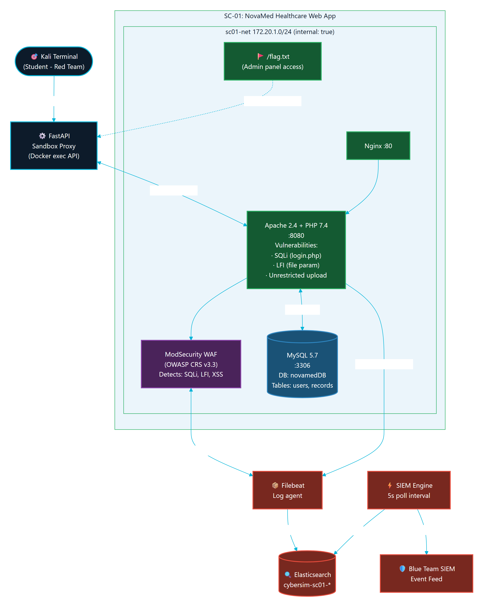
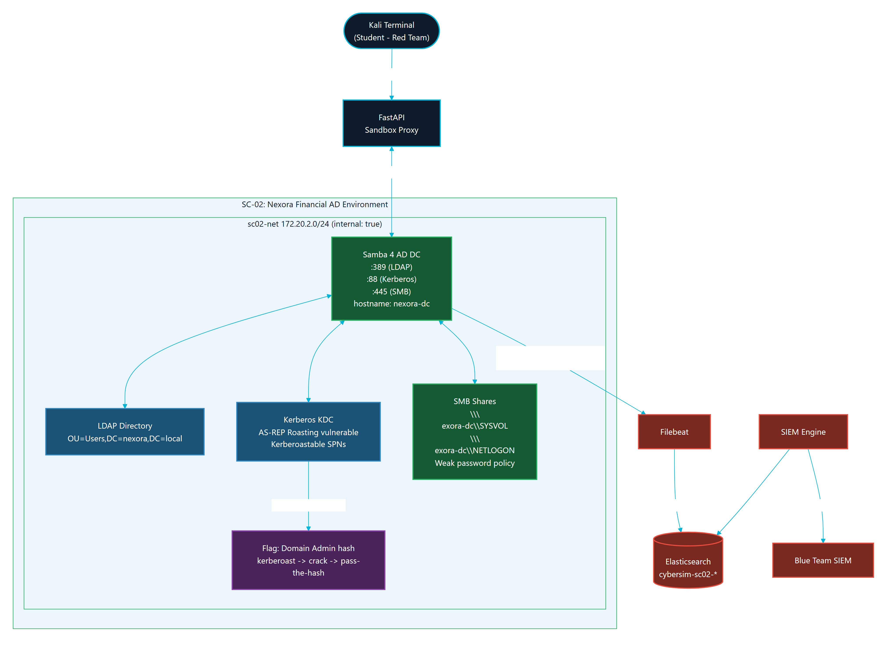
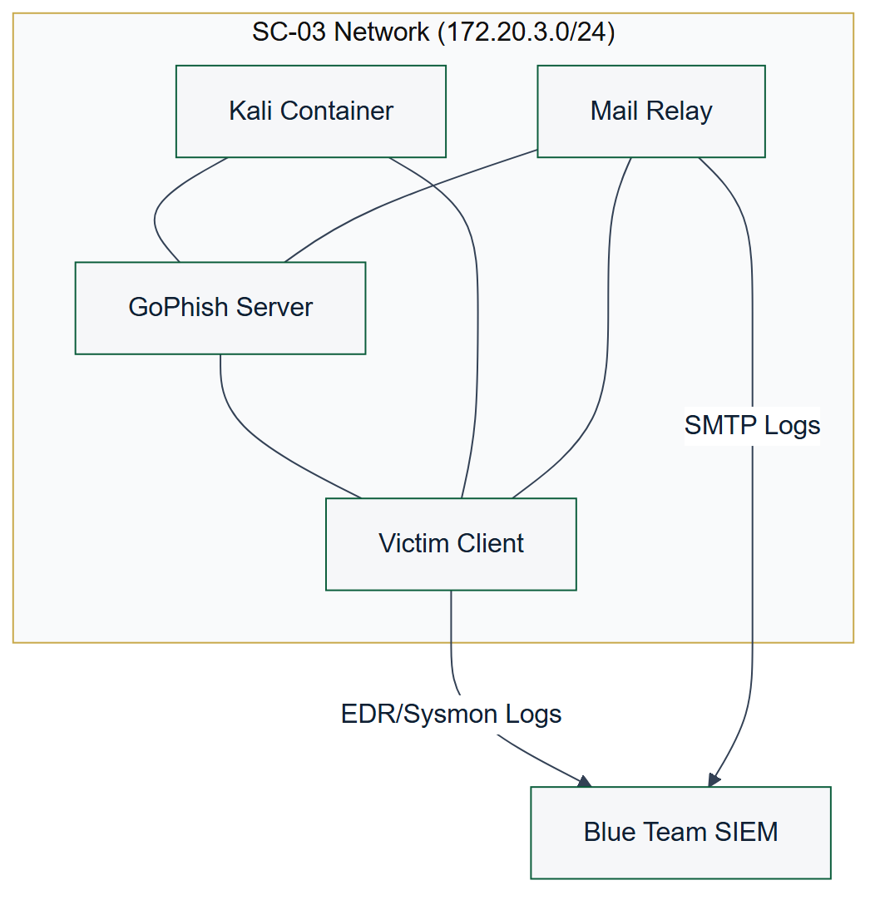
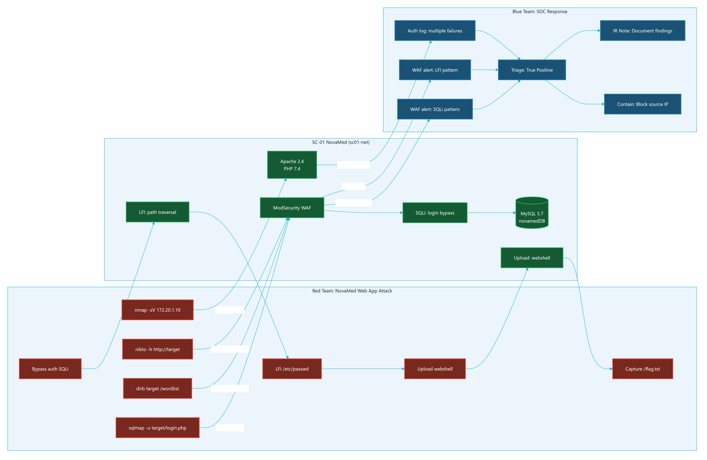

# CHAPTER 6: TESTING, INSTALLATION, AND OPERATIONS

## 6.1 Chapter Purpose

This chapter documents how Parallax is installed, verified, and operated for a university lab or graduation defense. The goal is to show that the platform is not only designed and implemented, but also testable, repeatable, and recoverable.

## 6.2 Testing Strategy

Parallax uses layered verification:

| Layer | Verification method | Purpose |
| --- | --- | --- |
| Static configuration | `docker compose config --quiet` | Confirms Compose syntax and service topology are valid |
| Backend unit tests | `python -m pytest` from the backend test suite | Confirms deterministic backend behavior |
| Frontend lint | `npm run lint` from the frontend workspace | Confirms JavaScript/React quality gates |
| Frontend build | `npm run build` from the frontend workspace | Confirms production bundle generation |
| Demo readiness | `python scripts/demo_check.py --scenarios all` | Confirms running services and scenario ports |
| Browser smoke | Manual browser walkthrough | Confirms UX, terminal focus, SIEM view, and role workflows |
| Documentation QA | `git diff --check`, ASCII checks, trailing-whitespace checks | Confirms report sources are clean and portable |

The final defense package should include command output evidence under `docs/final-report/evidence/test-output/`.

## 6.3 Test Evidence Requirements

The final evidence bundle should contain:

- Current commit hash and git status.
- Compose configuration check output.
- Backend test summary.
- Frontend lint summary.
- Frontend production-build summary.
- Demo readiness summary.
- Screenshot inventory.
- Any known failures and the fix path.

Evidence should be summarized in the report. Long logs should remain in appendices or evidence files.

## 6.4 Local Installation

The recommended local installation process is:

```bash
git clone <repository-url>
cd JUTerminal1
cp .env.example .env
docker compose up -d
```

After `.env` is created, set a real `JWT_SECRET`. Set `OPENROUTER_API_KEY` only if live AI Tutor responses are required. Without a provider key, Parallax should still provide fallback guidance.

## 6.5 Starting Scenario Profiles

Parallax keeps scenario services behind Compose profiles so that the operator can start only what is needed:

```bash
docker compose --profile sc01 up -d
docker compose --profile sc02 up -d
docker compose --profile sc03 up -d
```

This is important for local machines with limited RAM. Elasticsearch and directory-service scenario containers can be resource intensive during startup.

## 6.6 Access Points

| Service | Local URL | Purpose |
| --- | --- | --- |
| Frontend | `http://localhost:3000` | Main Parallax user interface |
| Backend API docs | `http://localhost:8001/api/docs` | FastAPI documentation and route inspection |
| Backend health | `http://localhost:8001/health` | Basic service status |
| Readiness endpoint | `http://localhost:8001/api/health/readiness` | Postgres, Redis, and Elasticsearch readiness |

The local Nginx or demo Caddy layer may provide additional routing depending on the selected deployment mode.

## 6.7 Readiness Procedure

Before a lab or defense:

1. Start the core Docker stack.
2. Start the required scenario profile.
3. Run `docker compose config --quiet`.
4. Run `python scripts/demo_check.py --scenarios all` for full-stack verification, or use the specific scenario option for a smaller run.
5. Open the frontend in a browser.
6. Register or sign in.
7. Start a scenario.
8. Confirm terminal connectivity.
9. Open the Blue Team workspace and confirm SIEM panels render.
10. Capture screenshots for documentation after redacting sensitive values.

## 6.8 Browser Smoke Test

The browser smoke test should cover:

- Authentication page.
- Dashboard with SC-01, SC-02, and SC-03.
- Rules of Engagement acknowledgement.
- Red Workspace terminal connection.
- Notes panel.
- AI Tutor panel.
- Blue Workspace SIEM feed.
- Debrief page.
- Instructor Dashboard for an instructor account.

The final report should include selected screenshots, not every screen.

## 6.9 Operations and Recovery

Common recovery actions:

| Issue | Action |
| --- | --- |
| Frontend stale after rebuild | Rebuild and restart the frontend service |
| Backend cannot reach data services | Check Postgres and Redis health, then restart backend |
| Elasticsearch not ready | Wait for startup, check memory, then restart Elasticsearch/Filebeat if needed |
| Scenario profile unhealthy | Restart only that scenario profile before restarting the full stack |
| Terminal attach failure | Check backend logs, Docker socket access, and session-container state |
| Demo machine under memory pressure | Stop unused scenario profiles and rerun readiness |

During a graded session, avoid deleting volumes unless the instructor accepts loss of session data.

## 6.10 Documentation Quality Assurance

The final report workspace is checked with:

```bash
git diff --check -- docs/final-report docs/architecture/CONTINUOUS_STATE.md
rg -n "[^\\x00-\\x7F]" docs/final-report
rg -n "[ \\t]+$" docs/final-report
```

These checks help keep the Markdown portable for DOCX/PDF production and prevent accidental formatting regressions.

## 6.11 Security Verification

Security checks before final export:

- Confirm scenario Docker networks remain internal-only.
- Confirm `.env` is not committed.
- Confirm report screenshots do not expose API keys or tokens.
- Confirm scenario documentation excludes full solution chains and lab-only secrets.
- Confirm AI prompt and AI validation preserve Socratic guidance.
- Confirm public-facing documentation says Parallax is lab-only.

## 6.12 Scenario Lab Topologies and Attack-Defense Flow

The readiness and smoke procedures above are exercised against three isolated scenario environments. Each environment is a self-contained set of Docker services on an internal-only network. The topologies below document the lab targets that an operator verifies during readiness checks; they intentionally omit solution chains and lab-only credentials.

### 6.12.1 SC-01 NovaMed Topology

SC-01 (NovaMed Healthcare) is the web application security scenario. Figure 6.1 shows its target chain of a web front end, a web application firewall, and a backing database service on the `sc01-net` internal network.



Figure 6.1: SC-01 (NovaMed) scenario topology.

### 6.12.2 SC-02 Nexora Topology

SC-02 (Nexora Financial) is the directory-service compromise scenario. Figure 6.2 shows its domain controller and file server targets on the `sc02-net` internal network, which produce authentication and access telemetry for the Blue Team.



Figure 6.2: SC-02 (Nexora) scenario topology.

### 6.12.3 SC-03 Orion Topology

SC-03 (Orion Logistics) is the phishing and initial-access scenario. Figure 6.3 shows its phishing platform, mail relay, and victim simulator on the `sc03-net` internal network.



Figure 6.3: SC-03 (Orion) scenario topology.

### 6.12.4 SC-01 Attack-Defense Correlation

Figure 6.4 illustrates the end-to-end attack-and-defense correlation for SC-01: how a Red Team action against the NovaMed targets produces telemetry that surfaces as a Blue Team SIEM event and, ultimately, debrief evidence. It is the verification-time view of the Red-to-Blue loop described in Chapter 4.



Figure 6.4: SC-01 NovaMed attack and defense correlation.

## 6.13 Chapter Summary

Parallax is installed and operated through repeatable Docker Compose commands, scenario profiles, readiness scripts, and browser smoke tests. The testing approach combines automated checks with manual UX verification so that the final defense package can show both technical correctness and operational readiness.
